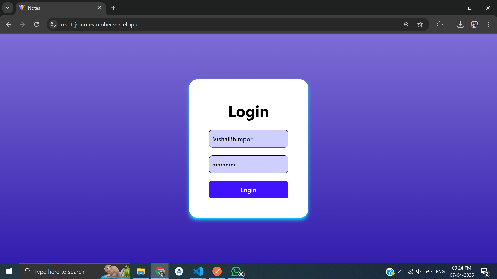
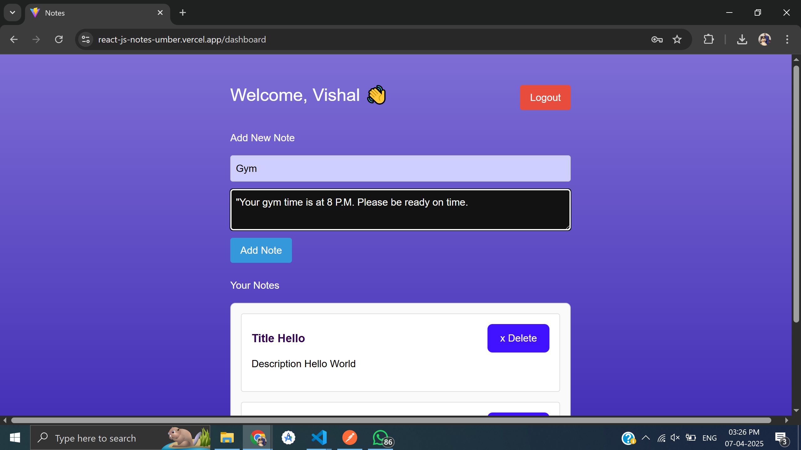
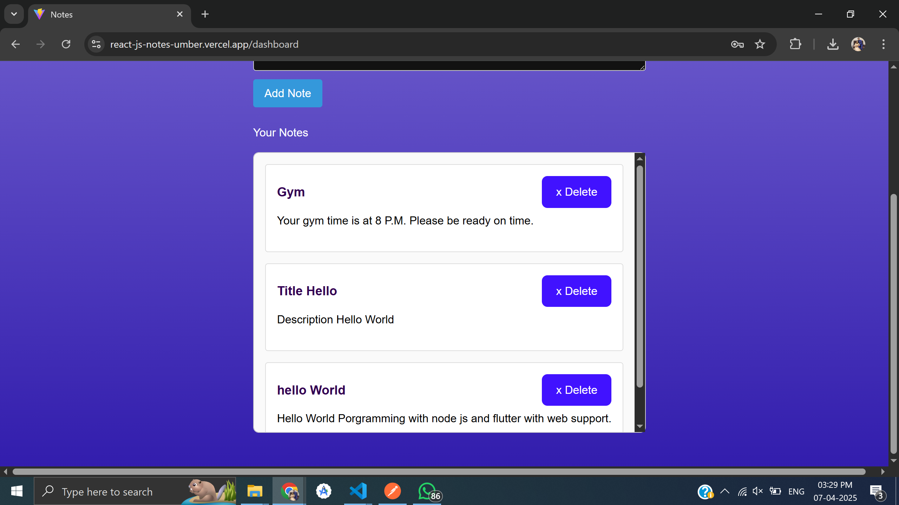

# 📝 Notes Dashboard - React App

This is a simple notes dashboard web application built using **React.js**, **TypeScript**, and **Axios**. It supports user authentication and CRUD operations for notes (create, fetch, delete).

---

## ✨ Features

- 🔐 User Authentication using JWT tokens
- 📥 Fetch notes from a backend API
- ➕ Add new notes
- ❌ Delete notes
- 📦 Axios for API communication
- 💅 Styled with custom CSS
- ⚙️ Environment-based API configuration

---

## 🚀 Tech Stack

- React.js (with TypeScript)
- Axios
- Custom CSS
- Vite (optional, if used)
- Node.js backend (for API, assumed)

---

## 📁 Project Structure

\`\`\`
src/
├── components/
│ └── AuthContext.tsx
│ └── PrivateRoute.tsx
│ └── PublicRoute.tsx
├── pages/
│ └── Login.tsx
│ └── Dashboard.tsx
├── styles/
│ └── Dashboard.css
│ └── Login.css
├── App.tsx
├── main.tsx
└── ...
\`\`\`

---

## ⚙️ Environment Variables

Make sure to set up the `.env` file in your project root:

\`\`\`env
VITE_BASE_URL=http://localhost:5000/api
\`\`\`

---

## 🛠️ Installation

1. **Clone the repo**

\`\`\`bash
git clone https://github.com/your-username/notes-dashboard.git
cd notes-dashboard
\`\`\`

2. **Install dependencies**

\`\`\`bash
npm install
\`\`\`

3. **Start the development server**

\`\`\`bash
npm run dev
\`\`\`

---

## 📸 Screenshots

---

## 📦 API Endpoints (Assumed)

| Method | Endpoint             | Description         |
| ------ | -------------------- | ------------------- |
| GET    | \`/note/fetch\`      | Fetch all notes     |
| POST   | \`/note/create\`     | Create a new note   |
| DELETE | \`/note/delete/:id\` | Delete a note by ID |

---

## 📄 License

This project is licensed under the MIT License.

---

## 👨‍💻 Author

Developed by [Vishal Bhimporwala](https://github.com/vishalbhimporwala) ✨
